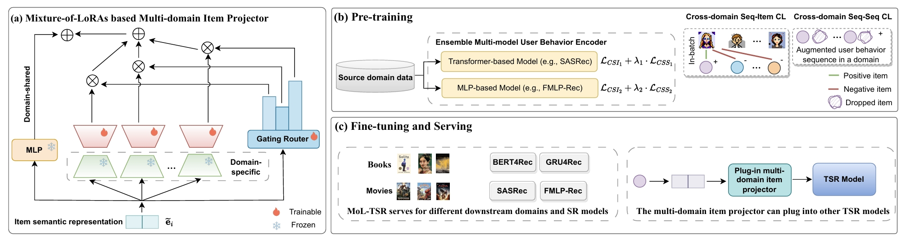

# MoL-TSR

## Overview

we propose **MoL-TSR**, which stands for **M**ixture-**o**f-**L**oRAs model for **T**ransferable **S**equential **R**ecommendation. Aiming to serve for not only different downstream domains, but also various downstream models.




## Requirements

```
recbole>=1.1.1
python>=3.9.7
cudatoolkit>=11.3.1
pytorch>=1.11.0
numpy>=1.21.6
cupy>=11.6.0
tqdm>=4.64.1
```

## Acknowledgements

Our code is based on the implementation of [MISSRec](https://github.com/gimpong/MM23-MISSRec) and [RecBole](https://github.com/RUCAIBox/RecBole).

## Contact

If you have any question, you can raise an issue or email Wenqi Sun (wenqisun@ruc.edu.cn). We will reply you soon.
